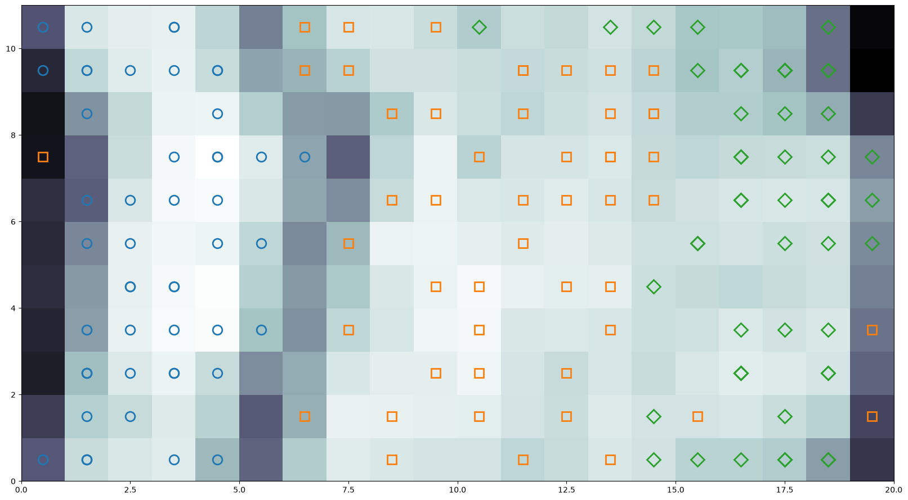

# Getting started

## Install

```bash
pip install python-som

# with tqdm progress bars during training
pip install "python-som[cli]"
```

Requires Python 3.10 or later.

## A complete example

This walks through the Iris dataset end to end. The runnable version is
[`examples/iris.py`](https://github.com/andremsouza/python-som/blob/master/examples/iris.py).

### Load the data

```python
import numpy as np
import seaborn as sns

iris = sns.load_dataset("iris")
target = iris.iloc[:, -1].to_numpy()
features = iris.iloc[:, :-1].to_numpy()
```

### Build the map

```python
import python_som

som = python_som.SOM(
    x=20,
    y=None,  # chosen from the data by PCA
    input_len=features.shape[1],
    learning_rate=0.5,
    neighborhood_radius=1.0,
    neighborhood_function="gaussian",
    cyclic_x=True,
    cyclic_y=True,
    data=features,  # required when a dimension is None
    random_seed=42,
)
print(som.get_shape())
```

Leaving one dimension as `None` asks the library to pick it. Kohonen Section 3.5 advises matching
the side lengths to *"the lengths of the two largest principal components"*; since a component is a
unit direction, its length in the data is the standard deviation, so the ratio is
$\sqrt{\lambda_1/\lambda_2}$.

### Initialize the models

```python
som.weight_initialization(mode="linear", data=features)
```

Linear initialization is the one to prefer. Kohonen Section 4.3: *"much faster and convergence
follow if the initial values are selected as a regular, two-dimensional sequence of vectors taken
along a hyperplane spanned by the two largest principal components"*. It is also the only
deterministic initializer.

The alternatives are `mode="random"` (draws from a distribution) and `mode="sample"` (copies random
rows of your data).

### Train

```python
error = som.train(features, n_iteration=len(features), mode="batch", verbose=True)
print(f"quantization error: {error:.4f}")
```

See [Training modes](training-modes.md) for how the three modes differ and why batch is
recommended.

### Inspect the result

```python
umatrix = som.distance_matrix().T  # the U-matrix
activations = som.activation_matrix(features)  # samples per node
labels = som.label_map(features, target)  # label frequencies per node
```

### Plot it

```python
import matplotlib.pyplot as plt

plt.figure(figsize=som.get_shape())
plt.pcolor(umatrix, cmap="bone_r")

markers, colors = ["o", "s", "D"], ["C0", "C1", "C2"]
codes = {name: i for i, name in enumerate(np.unique(target))}
for sample, label in zip(features, target):
    w = som.winner(sample)
    plt.plot(
        w[0] + 0.5,
        w[1] + 0.5,
        markers[codes[label]],
        markerfacecolor="None",
        markeredgecolor=colors[codes[label]],
        markersize=12,
        markeredgewidth=2,
    )
plt.axis((0, som.get_shape()[0], 0, som.get_shape()[1]))
plt.savefig("iris.png")
```



Darker regions of the U-matrix mean neighbouring models are far apart, so they read as boundaries
between clusters.

## Progress output

`verbose=True` shows a tqdm progress bar when `python-som[cli]` is installed. It also logs on the
`python_som` logger at INFO level, which is off by default the way any library logger is; enable it
with:

```python
import logging

logging.basicConfig(level=logging.INFO)
```

## Reproducibility

```python
som = python_som.SOM(x=10, y=10, input_len=4, random_seed=42)
print(som.get_random_seed())
```

Same seed, same map. The generator belongs to the instance, so building a SOM will not disturb
NumPy's global random state. Note that seeds do not reproduce across the 0.3.0 boundary; see the
warning in [Training modes](training-modes.md#reproducibility).
